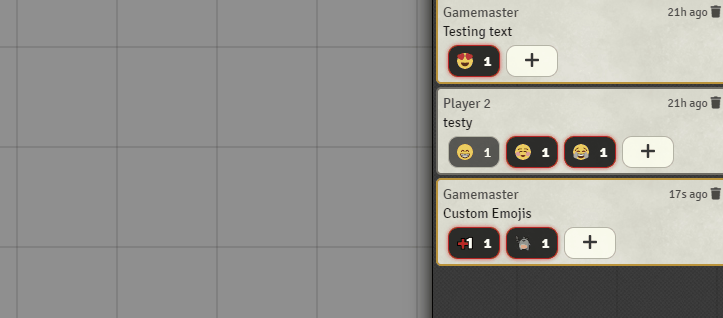

# Why?
     
An image is worth a thousand words, therefore a animated parrot gif must be worth a million . This module is there so your players can react to chat messages / rolls or just anything with more than just words.

# Current Features
 - Adds Emoji Picker to Chat items / rolls
 - Loads Custom Emojis from a dedicated emoji folder and adds them to the picker
 - Loads Custom Emojis from "Emoji Packs" that can be installed as side modules (no scripting required)

# Development Instructions From the Template:
About Bundler:  
This project uses webpack to bundle your files. What this means is that every script file in src/ will get 'bundled' into one output .js file in dist/.
Likewise every static file (.html, .json, etc.) in static/ will get moved to dist.  
Because of this you should NOT have your development working directory inside the foundryuser folder. Instead you should follow the instructions below
for setting up symantic links between the dist/ folder and foundryuser.


- Run npm install
- Rename module.ts to your chosen module name.
- Rename the references to module.ts in webpack.config.js file. (Line 26)
- Fill in module.json with actual information.
- run: npm run build  
- Create a symantic link between the dist/ folder to a module folder in FoundryUser/Data/modules/[MODULE_NAME]  
--	Instructions (for windows) 
--	Open a command prompt and navigate to FoundryUser/Data/modules   
--	Run: mklink /D MODULE_NAME [DEVELOPMENT_PATH]/dist  

A note on typescript, it is completely optional and if you do not wish to use then rename any .ts files and their references to .js.

# How It works
This is how the emoji magic happens     
## Handling Custom Emojis
The picker requires an Object with the following information for custom emoji        
```
{ 
    name: "name of the emoji", 
    emoji: "path/to/emoji"
}
```
### 
## On SocketLib.ready
This event is a custom event for the [Stäbchenfisch's Socketlib module](https://github.com/manuelVo/foundryvtt-socketlib) which is used to handle functions remotely as a GM. It is explained [here](#On-Emoji) if you want to be naughty and skip ahead.
## On Init
As per the BadIdeasBureau's suggestion, the module looks through all the other modules for an **emojiPack** flag. This flag should be of type **String** that points to the directory that contains emojis in the modules folder.

The module then proceeds to check these folders for all their emoji files and adds them to the picker with the relevant [emoji data](#Handling-Custom-Emojis)

If the emoji directory is defined , the module then goes through the emoji directory and loads the images as custom emojis using the file name as the name and path for the emoji data type.

The picker is then created and all the customEmojis are loaded into the picker via the constructor and all the awesome emojis are loaded. All further functionality is handled when the picker selects an emoji

```
  picker = new EmojiButton({
    style: "twemoji",
    custom: customEmojis,
  }) as EmojiButton;
```


### Example of Emoji Data Load
If we have the path to an emoji **emojis/shipitparrot.gif**. The path is then disected to retrieve the name and keep the path for the emoji itself. The result would be a mistake like this  :
```
{ 
    name: "shipitparrot", 
    emoji: "emojis/shipitparrot.gif"
}
```

## On RenderChatMessage
To those who arent aware "renderChatMessage" is a hook/event fired by foundry on the render of a chat message. The module uses this event to know its time to shine and render three main items:
 - Reactions
 - Active Reactions
 - Picker Button

         
### ***Reactions***
These buttons are essentially created when people other than the user have reacted to a chat message and are unhighlighed and deconstrasted to make sure the user is fully aware that they have not reacted to the chat message in the same way.

These buttons are clickable and trigger the handler function which adds their id as a part of those who have reacted to the chatmessage the same way.

### ***Active Reactions***
These buttons are essentially the same as normal reactions but have their style changed to be highlighted and more out there to show that they have indeed reacted to the chat message.

These buttons are clicakble and trigger the handler function which would remove their id from the list of those who have reacted to the chat message. ***If the array of ids is empty, the flag is deleted from the chat message and the button is unrendered***

### ***Picker Button***
This button is rendered at the end of the list of buttons and triggers the emoji picker. It also highlights that specific message as the current message that you are "focusing" on and toggles the picker.

## On Emoji
This is a custom event for the picker that returns the selection of the user.

Though a small function on its own is where a lot of the magic happens. The module uses  [Stäbchenfisch's Socketlib](https://github.com/manuelVo/foundryvtt-socketlib) module to launch an execute as GM function because in games where only the GM has the ability to modify chat messages this allows any user to still react when a GM is present and kind of side stepping the restrictions for this one use case.

The function remotely launches the **handleReaction** function and passes the emoji data, focusedMessage and the user data of the one who requested it

## HandleReaction
This function is essentially core to the emoji functionality.
The abstracted view looks like the following:       

``` 
function handleReaction(emoji: string, sentMessage:chatMessage, user: User) 
```     

The function essentially firstly gets the chatMessage locally to avoid race conditions and reads the emoji flag of the chatMessage which is a JSON object as depicted below:

```
emoji : [
    unicode_emoji: [user_id,user_id],
    another_unicode_emoji: [user_id,user_id],
    another_unicode_emoji: [user_id,user_id],
]
```
Upon getting the current emoji state it handles the logic of the emojis and rewrites the state of the emoji based on the following use cases.

### **User is the first to react with that emoji**
- Add the emoji to the overall list
- Add user to that list

### **User is not the first to react with that emoji**
- Add user to the list of user_ids

### **User already reacted with that emoji**
- Remove user from the list of user_ids
- If the list of user_ids is empty, remove the reaction     

        Words of Warning        
        All emoji data unless being displayed are actively stored as unicode or in the case of paths for custom emojis are left alone. Emojis are not used to data storage simply because I wanted to avoid any potential issues.
        


# Development Commands:
Development: 
To run with hotswap enabled run the command: npm run start

Release:
To ready the project for release run the command: npm run build:production

# Credits:
BadIdeasBureau, MrPrimate, Calego, Stäbchenfisch, Zeel, Arcanist, LukeAbby, Animu36 and many more from the League of Extraordinary FoundryVTT Developers for all the help and advice   
Emoji Button by JoeAttardi for Picker Functionality: https://github.com/joeattardi/emoji-button     
Used webpack and setup files as reference: https://github.com/anvil-vtt/FateX   
Used github workflow and template reference: https://github.com/League-of-Foundry-Developers/FoundryVTT-Module-Template   
